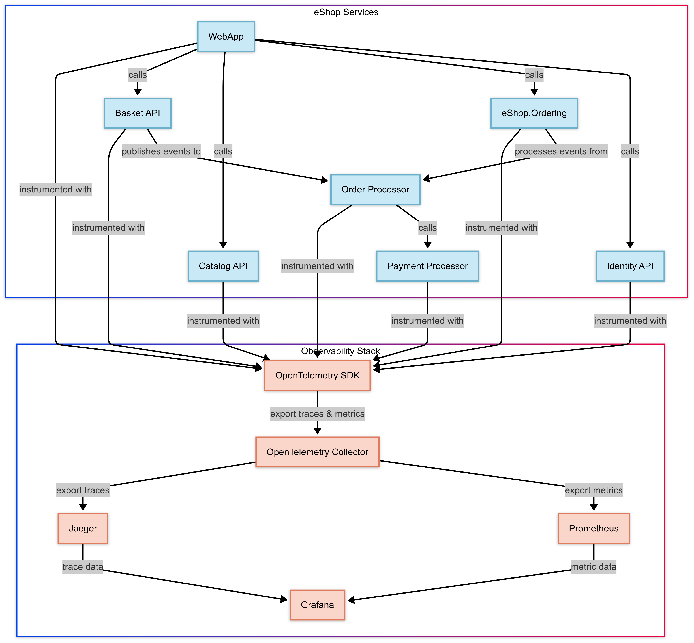

# eShop OpenTelemetry & Security Integration

## Project Overview

This project extends Microsoft's eShop reference microservices application with comprehensive OpenTelemetry instrumentation and security enhancements. The implementation focuses on the Order Creation flow, ensuring complete tracing from frontend to database while properly masking sensitive data such as payment information and personal identifiers.

## Technology Stack

- **ASP.NET Core**: Underlying framework for all microservices
- **OpenTelemetry**: Core instrumentation library for collecting traces, metrics, and logs
- **Jaeger**: Distributed tracing system for visualizing request flows across services
- **Prometheus**: Time series database for metrics collection and storage
- **Grafana**: Dashboard platform for creating unified visualizations
- **k6**: Load testing tool for verification and performance testing
- **Docker**: Containerization for services and observability stack

## Architecture

The eShop application with observability components follows this architecture:



For a detailed sequence diagram explaining the data flow, see the [telemetry flow documentation](docs/eshop-sequence-diagram.md).

## How to Build and Run the eShop Environment with Observability

### Prerequisites

- Docker Desktop
- .NET 9 SDK
- Visual Studio 2022 or JetBrains Rider (recommended)
- Git

### Setup Steps

1. Clone the repository with the observability changes:

```bash
git clone https://github.com/MrLoydHD/eShop
cd eShop
```

2. Start the application with observability components (In the base folder):

```bash
# Start all services including observability stack
dotnet run --project src/eShop.AppHost/eShop.AppHost.csproj
```

Alternatively, using Visual Studio or Rider:
- Open `eShop.sln`
- Set `eShop.AppHost` as the startup project
- Run the application

3. Verify all services are running:

```bash
docker ps
```

You should see containers for all eShop services plus:
- jaeger (port 16686)
- prometheus (port 9090)
- grafana (port 3000)
- otel-collector

## Steps to Configure and Launch the OpenTelemetry Collectors/Exporters

The OpenTelemetry collector is automatically configured as part of the application startup. However, if you need to customize the configuration:

1. Navigate to the collector configuration:

```bash
cd observability/otel-collector
```

2. Edit the `config.yaml` file to adjust collectors, processors, or exporters:

```yaml
receivers:
  otlp:
    protocols:
      grpc:
        endpoint: 0.0.0.0:4317
      http:
        endpoint: 0.0.0.0:4318

processors:
  batch:
    timeout: 1s
    send_batch_size: 1024
  
  # PII filtering processor
  attributes:
    actions:
      - key: http.request.header.authorization
        action: update
        value: "REDACTED"
      - key: email
        action: update
        value: "REDACTED"

exporters:
  jaeger:
    endpoint: jaeger:14250
    tls:
      insecure: true
  prometheus:
    endpoint: 0.0.0.0:8889

service:
  pipelines:
    traces:
      receivers: [otlp]
      processors: [attributes, batch]
      exporters: [jaeger]
    metrics:
      receivers: [otlp]
      processors: [batch]
      exporters: [prometheus]
```

3. Restart the observability stack for changes to take effect:

```bash
docker compose restart otel-collector
```

## Instructions to Set Up or View the Grafana Dashboard

Grafana is automatically provisioned with dashboards. To access them:

1. Open your browser and navigate to [http://localhost:3000](http://localhost:3000)

2. Log in with the following credentials:
    - Username: `admin`
    - Password: `admin`

3. Navigate to the dashboards by clicking on the "Dashboards" link in the left sidebar

4. Available dashboards:
    - **eShop Overview**: General system health and metrics
    - **Order Processing**: Detailed metrics for the order flow
    - **Service Performance**: Technical metrics for each service

For adding custom dashboards:

1. Place JSON dashboard definitions in `observability/grafana/dashboards/`
2. Update provisioning settings in `observability/grafana/provisioning/`
3. Restart the Grafana container:

```bash
docker compose restart grafana
```

## Load Testing the Application

A comprehensive load testing suite is included to verify the observability implementation:

1. Install k6:
```bash
# For macOS
brew install k6

# For Windows (with Chocolatey)
choco install k6

# For Linux
sudo apt-key adv --keyserver hkp://keyserver.ubuntu.com:80 --recv-keys C5AD17C747E3415A3642D57D77C6C491D6AC1D69
echo "deb https://dl.k6.io/deb stable main" | sudo tee /etc/apt/sources.list.d/k6.list
sudo apt-get update
sudo apt-get install k6
```

2. Run the test suite:
```bash
# Navigate to the loadtest directory
cd loadtest

# Run the order creation test
k6 run order_failure_test.js
```

3. View results in Grafana dashboards to verify metrics collection

## Future Improvements

1. **Extended Service Coverage**: Add OpenTelemetry instrumentation to additional microservices
2. **Database Column Masking**: Implement SQL Server Dynamic Data Masking for production environments
3. **Automated Alerting**: Configure alert rules based on metrics thresholds
4. **Synthetic Monitoring**: Add continuous probing of critical API endpoints
5. **Log Integration**: Connect logs with traces for complete context

## Related Documentation

- [Detailed OpenTelemetry Implementation](docs/eshop-opentelemetry-doc.md): Comprehensive documentation of the implementation
- [Telemetry Flow Sequence Diagram](docs/eshop-sequence-diagram.md): Detailed sequence diagram of the instrumented order flow

## Conclusion

This implementation successfully adds observability and security to the eShop application, with a focus on the Order Creation flow. The OpenTelemetry integration provides comprehensive visibility into system behavior while ensuring that sensitive data is properly protected.

Key achievements:
- End-to-end distributed tracing across microservices
- Comprehensive metrics collection for business and technical insights
- Proper masking of sensitive data in telemetry
- Performance-optimized implementation with minimal overhead
- Robust testing infrastructure to verify telemetry collection

The system now provides both developers and business stakeholders with valuable insights into application behavior and performance, while maintaining appropriate security controls.