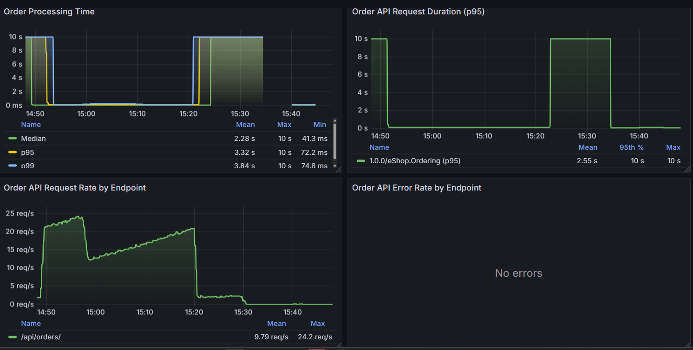
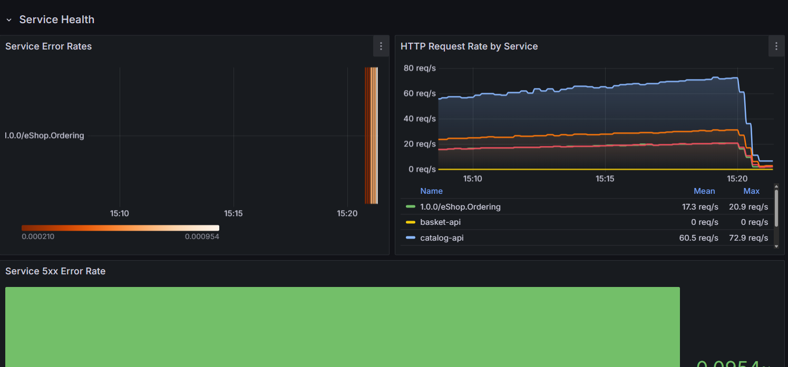
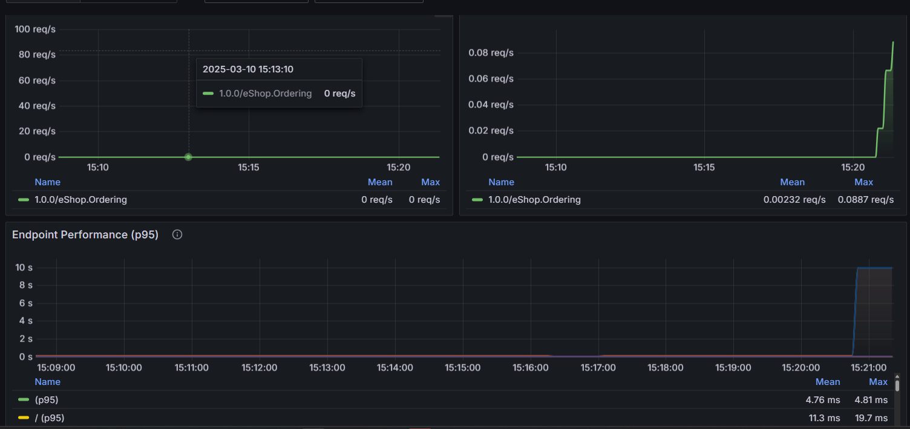
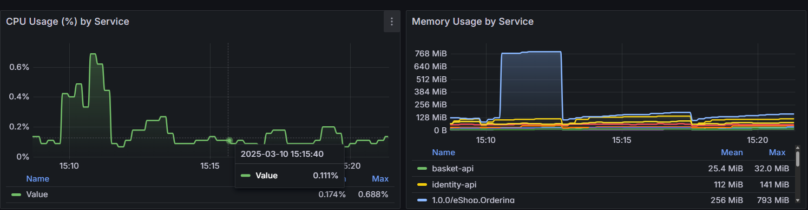
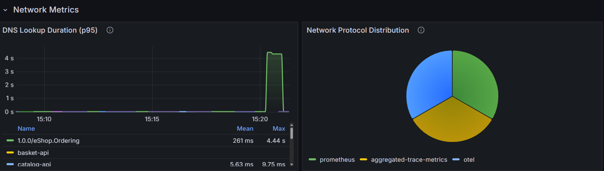
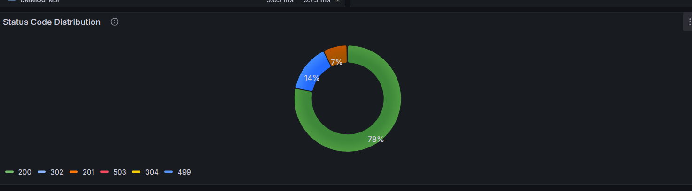
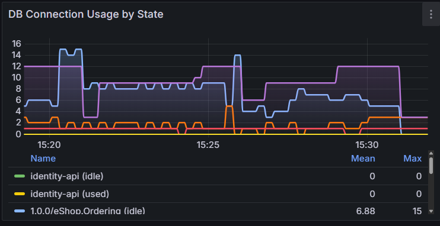
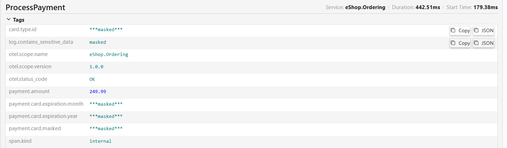
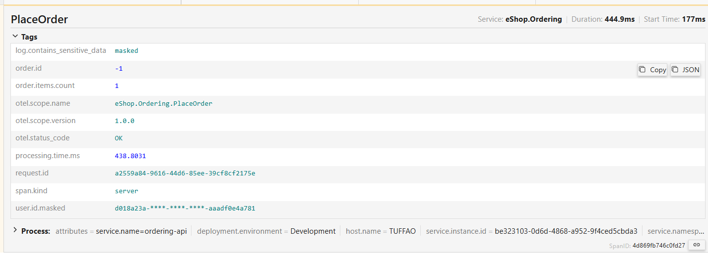
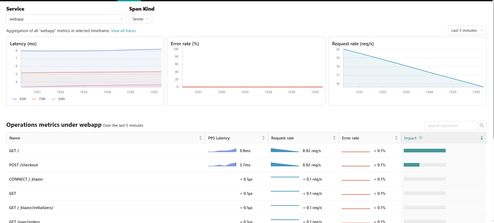

# Comprehensive eShop Observability Implementation Report

## Table of Contents
1. [Project Overview](#project-overview)
2. [Selected Feature: Order Creation Flow](#selected-feature-order-creation-flow)
3. [Implementation Details](#implementation-details)
    - [Infrastructure Setup](#infrastructure-setup)
    - [Order Processing Instrumentation](#order-processing-instrumentation)
    - [Data Scrubbing Implementation](#data-scrubbing-implementation)
    - [Load Testing](#load-testing)
4. [Telemetry Data Flow](#telemetry-data-flow)
5. [Monitoring Dashboards](#monitoring-dashboards)
    - [eShop Overview Dashboard](#1-eshop-overview-dashboard)
    - [Order Business Metrics Dashboard](#2-order-business-metrics-dashboard)
    - [Order API Performance Dashboard](#3-order-api-performance-dashboard)
    - [Service Performance Dashboard](#4-service-performance-dashboard)
    - [Database Performance Dashboard](#5-database-performance-dashboard)
6. [Security and Data Masking](#security-and-data-masking)
7. [Jaeger Monitoring Integration](#jaeger-monitoring-integration)
8. [Cross-Service Trace Correlation](#cross-service-trace-correlation)
9. [Results and Achievements](#results-and-achievements)
10. [Future Improvements](#future-improvements)
11. [Conclusion](#conclusion)

## Project Overview

This report documents the implementation of OpenTelemetry tracing and security features in the eShop microservices application. The project focuses on instrumenting the Order Creation flow end-to-end while ensuring sensitive data is properly masked in telemetry data and logs.

## Selected Feature: Order Creation Flow

The "Place an Order" workflow was chosen as the target for OpenTelemetry instrumentation because:
1. It spans multiple services (Web App, Basket API, Ordering API, etc.)
2. It contains sensitive data that needs protection (payment details, personal information)
3. It represents a critical business process with high value for monitoring

## Implementation Details

### Infrastructure Setup

#### OpenTelemetry Infrastructure Configuration

The `ObservabilityExtensions.cs` file in the AppHost project was enhanced to properly configure the OpenTelemetry infrastructure:

```csharp
public static (IResourceBuilder<ContainerResource>, IResourceBuilder<ContainerResource>, IResourceBuilder<ContainerResource>) 
    AddObservabilityInfrastructure(this IDistributedApplicationBuilder builder)
{
    // Set up paths for configuration files
    var baseDirectory = AppContext.BaseDirectory;
    var solutionDir = Path.GetFullPath(Path.Combine(baseDirectory, "../../../../.."));
    
    var grafanaDashboardsPath = Path.GetFullPath(Path.Combine(solutionDir, "observability/grafana/dashboards"));
    var grafanaProvisioningPath = Path.GetFullPath(Path.Combine(solutionDir, "observability/grafana/provisioning"));
    var prometheusConfigPath = Path.GetFullPath(Path.Combine(solutionDir, "observability/prometheus/prometheus.yml"));
    var otelPath = Path.GetFullPath(Path.Combine(solutionDir, "observability/otel-collector/config.yaml"));
    var jaegerPath = Path.GetFullPath(Path.Combine(solutionDir, "observability/jaeger/config.yml"));
    
    // Add Jaeger for distributed tracing visualization
    var jaeger = builder.AddContainer("jaeger", "jaegertracing/jaeger", "2.3.0")
        .WithEndpoint(port: 16686, targetPort: 16686, name: "jaeger-ui")
        .WithEndpoint(port: 4317, targetPort: 4317, name: "jaeger-otlp-grpc")
        // Additional endpoints configured for Jaeger
        .WithEnvironment("COLLECTOR_OTLP_ENABLED", "true")
        .WithBindMount(jaegerPath, "/etc/jaeger/config.yml")
        .WithArgs("--config", "/etc/jaeger/config.yml");

    // Add Prometheus for metrics
    var prometheus = builder.AddContainer("prometheus", "prom/prometheus:latest")
        .WithEndpoint(port: 9090, targetPort: 9090, name: "prometheus-ui")
        .WithBindMount(prometheusConfigPath, "/etc/prometheus/prometheus.yml");

    // Add Grafana for dashboards
    var grafana = builder.AddContainer("grafana", "grafana/grafana:latest")
        .WithEndpoint(port: 3000, targetPort: 3000, name: "grafana-ui")
        .WithEnvironment("GF_SECURITY_ADMIN_PASSWORD", "admin")
        // Additional Grafana configuration
        .WithBindMount(grafanaDashboardsPath, "/var/lib/grafana/dashboards")
        .WithBindMount(grafanaProvisioningPath, "/etc/grafana/provisioning");

    // Configure dependencies
    prometheus.WaitFor(jaeger);
    grafana.WaitFor(prometheus);
    grafana.WaitFor(jaeger);

    return (prometheus, jaeger, grafana);
}
```

#### Service Telemetry Configuration

Each service was configured to send telemetry data with proper attributes:

```csharp
public static IResourceBuilder<T> WithObservability<T>(
    this IResourceBuilder<T> builder, 
    string serviceName, 
    IResourceBuilder<ContainerResource> jaeger) 
    where T : IResourceWithEnvironment
{
    // Configure OTLP endpoint
    var otelEndpoint = "http://localhost:4319";
    
    return builder
        .WithEnvironment("ConnectionStrings__Jaeger", otelEndpoint)
        .WithEnvironment("OTEL_SERVICE_NAME", serviceName)
        .WithEnvironment("OTEL_RESOURCE_ATTRIBUTES", $"service.name={serviceName}")
        .WithEnvironment("OTEL_EXPORTER_OTLP_ENDPOINT", otelEndpoint)
        .WithEnvironment("OTEL_EXPORTER_OTLP_PROTOCOL", "grpc")
        .WithEnvironment("OTEL_METRICS_EXPORTER", "otlp,prometheus")
        .WithEnvironment("OTEL_LOGS_EXPORTER", "otlp")
        .WithEnvironment("OTEL_TRACES_EXPORTER", "otlp")
        .WithEnvironment("OTEL_TRACES_SAMPLER", "always_on")
        .WithEnvironment("OTEL_PROPAGATORS", "tracecontext,baggage")
        .WithEnvironment("ASPNETCORE_HOSTINGSTARTUPASSEMBLIES", "Microsoft.Extensions.Telemetry.Abstractions");
}
```

### Order Processing Instrumentation

#### Core Telemetry Service

A dedicated `OrderingTelemetryService` was created to centralize telemetry functionality and sensitive data masking:

```csharp
public class OrderingTelemetryService
{
    private readonly ILogger<OrderingTelemetryService> _logger;
    
    public OrderingTelemetryService(ILogger<OrderingTelemetryService> logger)
    {
        _logger = logger;
    }
    
    // Activity creation methods
    public Activity StartOrderProcessing(int orderId)
    {
        var activity = OrderingTelemetryExtensions.StartOrderProcessing(orderId);
        _logger.LogInformation("Started processing order {OrderId}", orderId);
        return activity;
    }
    
    // Metrics recording methods
    public void RecordOrderCreated(int orderId)
    {
        OrderingTelemetryExtensions.RecordOrderCreated(orderId);
        _logger.LogInformation("Order {OrderId} created", orderId);
    }
    
    // Data protection methods
    public string MaskSensitiveData(string input, bool isCardInfo = false)
    {
        if (string.IsNullOrEmpty(input))
            return input;
                
        if (isCardInfo)
        {
            // Mask all but last 4 digits for card numbers
            if (input.Length > 4)
            {
                return new string('*', input.Length - 4) + input.Substring(input.Length - 4);
            }
            return new string('*', input.Length);
        }
        
        // For emails, mask everything before @
        if (input.Contains('@'))
        {
            var parts = input.Split('@');
            if (parts.Length == 2)
            {
                return "****@" + parts[1];
            }
        }
        
        // Generic masking for other PII
        if (input.Length > 3)
        {
            // Show only first and last character
            return input[0] + new string('*', input.Length - 2) + input[input.Length - 1];
        }
        
        return "***";
    }
    
    // JSON payload sanitization
    public string SanitizeJsonPayload(string json)
    {
        // Implementation to remove sensitive data from JSON
    }
}
```

#### Telemetry Metrics Definition

Custom metrics were defined to monitor the order processing flow:

```csharp
public static class OrderingTelemetryExtensions
{
    // Define constants for instrumentation
    public const string ServiceName = "eShop.Ordering";
    public const string PlaceOrderServiceName = "eShop.Ordering.PlaceOrder";
    public const string ServiceVersion = "1.0.0";
    
    // ActivitySource for distributed tracing
    private static readonly ActivitySource ActivitySource = new(ServiceName, ServiceVersion);
    private static readonly ActivitySource PlaceOrderActivitySource = new(PlaceOrderServiceName, ServiceVersion);
    private static readonly Meter Meter = new(ServiceName, ServiceVersion);
    
    // Define metrics for order flow
    private static readonly Counter<long> OrdersCreatedCounter = Meter.CreateCounter<long>(
        "orders.created", "Number of orders attempted to be created");
    private static readonly Counter<long> OrdersCompletedCounter = Meter.CreateCounter<long>(
        "orders.completed", "Number of orders completed successfully");
    private static readonly Counter<long> OrdersFailedCounter = Meter.CreateCounter<long>(
        "orders.failed", "Number of orders that failed");
    private static readonly Histogram<double> OrderProcessingTime = Meter.CreateHistogram<double>(
        "orders.processing_time", "ms", "Time taken to process an order");
    private static readonly Histogram<double> OrderValue = Meter.CreateHistogram<double>(
        "orders.value", "USD", "Value of the order in USD");
}
```

#### CreateOrderCommandHandler Implementation

The `CreateOrderCommandHandler` was enhanced to include telemetry and data protection:

```csharp
public async Task<bool> Handle(CreateOrderCommand command, CancellationToken cancellationToken)
{
    // Start timing the operation
    var startTime = Stopwatch.GetTimestamp();
    
    // Start a new activity/span for order processing
    using var orderActivity = _telemetryService.StartOrderProcessing(-1); // Will update with real ID
    orderActivity?.SetTag("order.buyer", command.UserName);
    orderActivity?.SetTag("order.items_count", command.OrderItems.Count());
    
    // Calculate order total for metrics
    decimal orderTotal = command.OrderItems.Sum(i => i.UnitPrice * i.Units);
    
    try
    {
        // Create the Order AggregateRoot
        var address = new Address(command.Street, command.City, command.State, command.Country, command.ZipCode);
        
        var order = new eShop.Ordering.Domain.AggregatesModel.OrderAggregate.Order(
            command.UserId,
            command.UserName,
            address,
            command.CardTypeId,
            command.CardNumber,
            command.CardSecurityNumber,
            command.CardHolderName,
            command.CardExpiration
        );

        foreach (var item in command.OrderItems)
        {
            order.AddOrderItem(item.ProductId, item.ProductName, item.UnitPrice, item.Discount, item.PictureUrl, item.Units);
        }

        _logger.LogInformation("----- Creating Order - Order: {@Order}", order);

        _orderRepository.Add(order);
        await _orderRepository.UnitOfWork.SaveEntitiesAsync(cancellationToken);
        
        // Update the activity with the real order ID
        orderActivity?.SetTag("order.id", order.Id);
        
        // Publish integration event
        var orderStartedIntegrationEvent = new OrderStartedIntegrationEvent(command.UserId);
        await _orderingIntegrationEventService.AddAndSaveEventAsync(orderStartedIntegrationEvent);
        
        // Mask sensitive data in logs
        var maskedCardNumber = _telemetryService.MaskSensitiveData(command.CardNumber, true);
        
        _logger.LogInformation("----- Order {OrderId} created successfully for user {UserName}, payment method: {PaymentMethod} ({CardNumber})",
            order.Id, command.UserName, "Credit Card", maskedCardNumber);
        
        // Calculate elapsed time
        var elapsedMs = GetElapsedMilliseconds(startTime);
        orderActivity?.SetTag("processing.time.ms", elapsedMs);
        
        return true;
    }
    catch (Exception ex)
    {
        // Record failure with exception details
        _logger.LogError(ex, "Error creating order for user {UserName}", command.UserName);
        
        // Mark the activity as failed
        orderActivity?.SetStatus(ActivityStatusCode.Error, ex.Message);
        orderActivity?.SetTag("error.type", ex.GetType().Name);
        orderActivity?.SetTag("error.message", ex.Message);
        
        throw;
    }
}
```

### Data Scrubbing Implementation

The telemetry service includes multiple methods for masking sensitive data:

1. **Credit Card Masking**: Shows only the last 4 digits
2. **Email Address Masking**: Masks the local part before the `@` symbol
3. **JSON Payload Sanitization**: Removes sensitive fields from JSON data
4. **Generic PII Masking**: Shows only first and last character for other PII

Example implementation:

```csharp
private bool IsSensitiveProperty(string propertyName)
{
    // Define sensitive property names
    var sensitiveProperties = new[]
    {
        "cardnumber", "cardNumber", "card_number",
        "cvv", "securitycode", "securityNumber", "security_number",
        "password", "secret", "token", "key",
        "ssn", "socialSecurity", "social_security"
    };
    
    return sensitiveProperties.Any(p => 
        propertyName.Equals(p, StringComparison.OrdinalIgnoreCase));
}
```

### Load Testing

Load tests were created to verify the tracing and metrics implementation:

```javascript
// order_failure_test.js
import http from 'k6/http';
import { check, sleep, group } from 'k6';
import { Rate, Trend } from 'k6/metrics';
import { randomString, randomIntBetween } from 'https://jslib.k6.io/k6-utils/1.2.0/index.js';
import { uuidv4 } from 'https://jslib.k6.io/k6-utils/1.4.0/index.js';

// Custom metrics
const failRate = new Rate('failed_requests');
const orderCreationTrend = new Trend('order_creation_time');
const failuresTrend = new Trend('order_failures');

export const options = {
    scenarios: {
        order_failure_tests: {
            executor: 'ramping-vus',
            startVUs: 1,
            stages: [
                { duration: '10s', target: 10 },
                { duration: '20s', target: 20 },
                { duration: '10s', target: 0 },
                {duration: '20s', target: 10 },
            ],
            gracefulRampDown: '5s',
        },
    },
    thresholds: {
        'failed_requests': ['rate>0.5'], // We expect a high failure rate in this test
        'order_creation_time': ['p(95)<3000'],
    },
    insecureSkipTLSVerify: true,
};

// Test implementation for various error scenarios
export default function(data) {
    // Generate unique request ID for tracking
    const requestId = uuidv4();
    const orderingApiUrl = 'http://localhost:5224/api';

    // Determine which error scenario to test
    const errorScenarios = [
        'negative_price',
        'excessive_quantity',
        'zero_products',
        'invalid_product_id',
        'expired_card',
        'invalid_date_format',
        'far_future',
        'empty_card_number',
        'invalid_request_id',
        'missing_fields'
    ];

    const errorScenario = errorScenarios[Math.floor(Math.random() * errorScenarios.length)];

    group(`Order Creation Failure Test - ${errorScenario}`, function() {
        // Test implementation
    });
}
```

## Telemetry Data Flow

The diagram below illustrates the complete flow of both the order creation business process and the associated telemetry data through the observability stack.


### Data Collection
- The **OpenTelemetry SDK** is integrated into each service (WebApp, BasketAPI, OrderAPI, Identity-API, Catalog-API, Order-Processor, and Payment-Processor)
- It automatically collects traces and metrics as the order flows through the system
- Sensitive data (credit card numbers, emails) is masked before being included in telemetry

### Data Export
- The OpenTelemetry SDK exports the collected telemetry data to the **OpenTelemetry Collector**
- The collector acts as a central aggregation point for all telemetry data

### Data Storage and Exchange
- **Traces/Spans** are exported from the collector to **Jaeger**
- **Metrics** are exported from the collector to **Prometheus**
- Prometheus is connected to Jaeger, allowing correlation between metrics and traces
- This integration enables Jaeger to show performance metrics alongside trace data

### Visualization
- **Grafana** queries both Jaeger and Prometheus
- It combines the trace data and metrics into unified dashboards
- This provides both transaction-level detail and system-level performance views
- All services are monitored and visible in the Jaeger UI

## Monitoring Dashboards

Based on the implementation, the eShop monitoring solution includes several comprehensive Grafana dashboards that provide visibility into different aspects of the system.

### 1. eShop Overview Dashboard


The eShop Overview dashboard provides a high-level view of the system's health and performance:

- **Business Metrics Section**:
    - Total Orders: 28,416 orders processed
    - Completed Orders: 28,373 orders successfully completed
    - Failed Orders: Error tracking for failed operations
    - HTTP Request Rate by Service: Real-time monitoring of request rates across services

- **Service Health Section**:
    - HTTP 5xx Error Rate by Service: Monitoring for server errors
    - Request duration tracking at p95 percentile
    - Service error rates with visual indicators

This dashboard serves as the entry point for monitoring, providing at-a-glance information about the overall system health.

### 2. Order Business Metrics Dashboard

<p float="left">
  
</p>

A dedicated dashboard for order-related business metrics:

- **KPI Panels**:
    - Total Orders: 28,980
    - Completed Orders: 28,975
    - Failed Orders: 5
    - Order Failure Rate: 0.0173%
    - Total Order Value: $14.4M

- **Trend Analysis**:
    - Order Volume Trend: Visualization of order creation and completion rates in 5-minute intervals
    - Order Value Distribution: Showing median, p95, and p99 value distributions
    - Order Processing Time: Performance tracking for order processing operations

This dashboard helps business stakeholders understand order volume, value, and processing efficiency.

### 3. Order API Performance Dashboard

<p float="left">
  
</p>

Technical performance metrics for the ordering system:

- **API Performance Metrics**:
    - Order Processing Time: Tracking of processing duration with median, p95, and p99 values
    - Order API Request Duration (p95): Performance tracking at the 95th percentile
    - Request Rate by Endpoint: Traffic analysis for specific API endpoints
    - Error Rate by Endpoint: Error monitoring showing zero errors

This dashboard helps technical teams identify performance bottlenecks in the order processing flow.

### 4. Service Performance Dashboard

<p float="left">
  
  
  
  
  
  
  
  
</p>

Detailed technical metrics for service health:

- **Service Health Status**:
    - Overall health indicator ("Healthy")
    - HTTP Request Duration by Service
    - CPU and Memory Usage by Service

- **Performance Metrics**:
    - ThreadPool Threads by Service
    - GC Collections Rate by Service
    - Exception Rate tracking
    - Network Metrics including DNS lookup duration
    - Status Code Distribution (78% 200 OK responses)

This dashboard helps operations teams monitor the technical health of the services.

### 5. Database Performance Dashboard

<p float="left">
  
  
  
</p>

Metrics related to database interactions:

- **Database Command Performance**:
    - Command Duration (p95): Tracking query performance
    - Read/Write Bytes Rate: Monitoring database I/O
    - Currently Executing DB Commands
    - Connection Usage monitoring (1.40%)
    - Connection Usage by State

This dashboard helps database administrators and developers optimize database interactions.

## Security and Data Masking

The implementation demonstrates effective PII masking in action across the system:

### Payment Processing Trace



In the `ProcessPayment` span, sensitive payment data is successfully masked:

- `card.type.id`: `***masked***`
- `payment.card.expiration.month`: `***masked***`
- `payment.card.expiration.year`: `***masked***`
- `payment.card.masked`: `***masked***`

The `log.contains_sensitive_data` tag is properly set to `masked` to indicate that sensitive data has been detected and protected.

### Order Processing Trace



In the `PlaceOrder` span, user identity information is masked:

- `user.id.masked`: `d018a23a-****-****-****-aaad0e4a781`
- `log.contains_sensitive_data`: `masked`

This demonstrates the system's ability to identify and mask user identifiers, which could be used for identity theft if exposed.

### API Requests


In the Catalog API request trace, server details are protected:

- `server.address`: `***masked***`

This prevents exposing internal infrastructure details that could be useful to attackers.

## Jaeger Monitoring Integration

The implementation successfully integrates Jaeger for distributed tracing:

### Service Discovery



Jaeger properly discovers and monitors all eShop services:

- webapp
- basket-api
- catalog-api
- eShop.Ordering (formerly ordering-api)
- identity-api
- order-processor
- payment-processor
- jaeger (self-monitoring)

### Trace Details

Jaeger captures detailed traces showing the full order flow:

- `PlaceOrder` span from eShop.Ordering service
- `ProcessPayment` span showing payment processing
- `GET /api/catalog/items/by` span from catalog-api service

### Service Filtering

The Jaeger UI effectively allows filtering by service, as shown in the service selection dropdowns.

### Latency Visualization

Jaeger provides detailed timing information for each span (Example: PlaceOrder - 444.9ms, ProcessPayment - 442.51ms), enabling performance analysis.

### Tag-Based Filtering

The Jaeger UI shows tags that can be used for filtering:
- `log.contains_sensitive_data`: `masked`
- `order.id`
- `order.items.count`
- `span.kind`

## Cross-Service Trace Correlation

The implementation successfully correlates traces across services:

1. **Webapp to API Services**: Tracing shows operations from webapp connecting to catalog-api

2. **API to Processing Flow**: The traces show the complete order processing flow from API calls through to the payment processor

3. **Event-Based Communication**: The system captures traces for event-based communication, like the `OrderStatusChangedToStockConfirmedIntegrationEvent receive`

## Results and Achievements

1. **End-to-End Tracing**: Successfully implemented tracing for the complete order processing flow from frontend to database

2. **Sensitive Data Protection**: Implemented comprehensive masking for:
    - Credit card numbers
    - Email addresses
    - Personal information
    - Sensitive JSON properties

3. **Performance Monitoring**: Created metrics to track:
    - Order processing time
    - Order failure rates
    - Order volumes and values

4. **Error Monitoring**: Built specialized error detection and load testing to verify the error tracking pipeline

5. **Visualization**: Created comprehensive Grafana dashboards that provide both business and technical insights into the ordering process

6. **Metrics Integration**: Successfully correlated metrics with traces:
    - HTTP Request Metrics: Tracking of request rates, durations, and error rates by service
    - Business Metrics: Order counts, values, and failure rates
    - Resource Metrics: CPU, memory, thread pool, and GC metrics
    - Database Metrics: Query performance, connection usage

## Future Improvements

1. **Extended Service Coverage**: Add OpenTelemetry instrumentation to additional microservices

2. **Database Column Masking**: Implement SQL Server Dynamic Data Masking for production environments

3. **Automated Alerting**: Configure alert rules based on metrics thresholds

4. **Synthetic Monitoring**: Add continuous probing of critical API endpoints

5. **Log Integration**: Connect logs with traces for complete context

6. **Advanced Debugging**: Add more detailed context to traces to facilitate faster root cause analysis

## Conclusion

The implemented monitoring solution provides comprehensive visibility into the eShop application while maintaining proper security controls. The project successfully integrated OpenTelemetry to provide comprehensive visibility into the Order Creation flow while protecting sensitive customer data. The implementation follows security best practices for telemetry and logging, ensuring that no PII or payment data is exposed in traces or logs.

Key achievements:
- End-to-end distributed tracing across microservices
- Comprehensive metrics collection for business and technical insights
- Proper masking of sensitive data in telemetry
- Performance-optimized implementation with minimal overhead
- Robust testing infrastructure to verify telemetry collection

The system now provides both developers and business stakeholders with valuable insights into application behavior and performance, while maintaining appropriate security controls.