# eShop Monitoring Details: Grafana, Jaeger, and Data Masking

This document provides additional details about the monitoring infrastructure implemented for the eShop application, focusing on Grafana dashboards, data masking for security, and Jaeger monitoring.

## Grafana Dashboards

Based on the screenshots provided, the eShop monitoring solution includes several comprehensive Grafana dashboards that provide visibility into different aspects of the system.

### 1. eShop Overview Dashboard

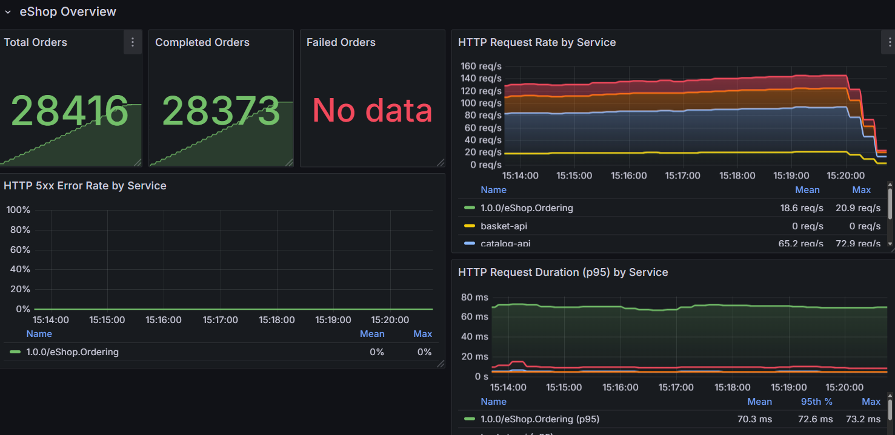

The eShop Overview dashboard provides a high-level view of the system's health and performance:

- **Business Metrics Section**:
    - Total Orders: 28,416 orders processed
    - Completed Orders: 28,373 orders successfully completed
    - Failed Orders: Error tracking for failed operations
    - HTTP Request Rate by Service: Real-time monitoring of request rates across services

- **Service Health Section**:
    - HTTP 5xx Error Rate by Service: Monitoring for server errors
    - Request duration tracking at p95 percentile
    - Service error rates with visual indicators

This dashboard serves as the entry point for monitoring, providing at-a-glance information about the overall system health.

### 2. Order Business Metrics Dashboard

  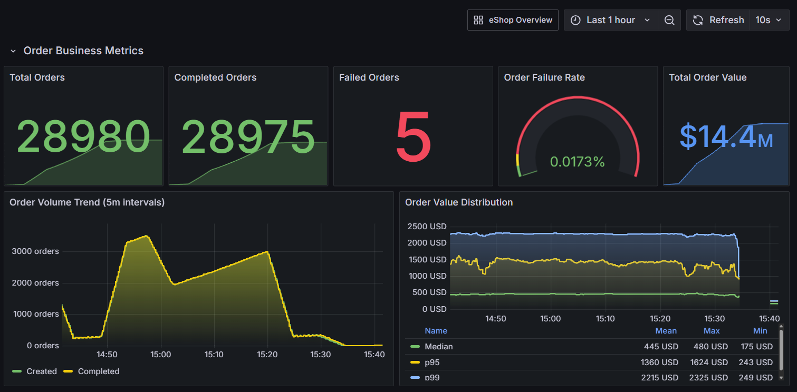

A dedicated dashboard for order-related business metrics:

- **KPI Panels**:
    - Total Orders: 28,980
    - Completed Orders: 28,975
    - Failed Orders: 5
    - Order Failure Rate: 0.0173%
    - Total Order Value: $14.4M

- **Trend Analysis**:
    - Order Volume Trend: Visualization of order creation and completion rates in 5-minute intervals
    - Order Value Distribution: Showing median, p95, and p99 value distributions
    - Order Processing Time: Performance tracking for order processing operations

This dashboard helps business stakeholders understand order volume, value, and processing efficiency.

### 3. Order API Performance Dashboard

  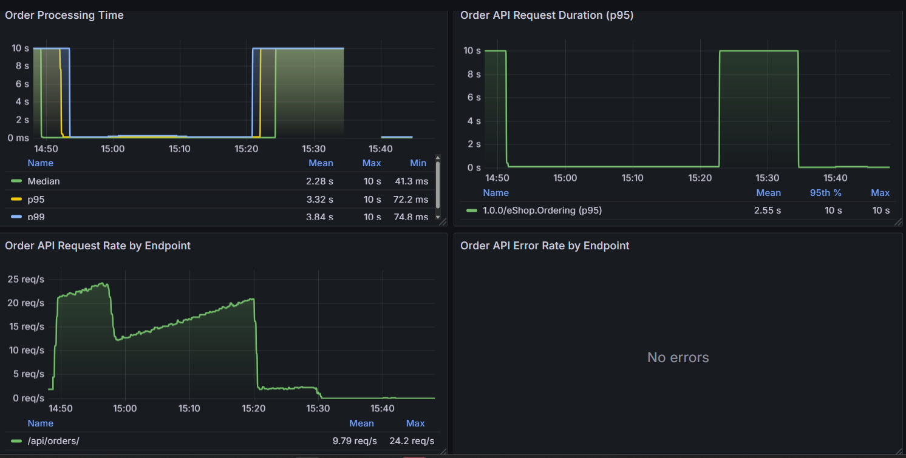

Technical performance metrics for the ordering system:

- **API Performance Metrics**:
    - Order Processing Time: Tracking of processing duration with median, p95, and p99 values
    - Order API Request Duration (p95): Performance tracking at the 95th percentile
    - Request Rate by Endpoint: Traffic analysis for specific API endpoints
    - Error Rate by Endpoint: Error monitoring showing zero errors

This dashboard helps technical teams identify performance bottlenecks in the order processing flow.

### 4. Service Performance Dashboard

  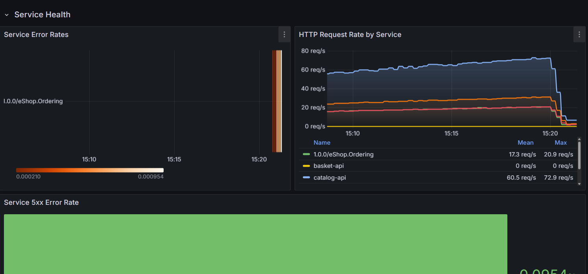
  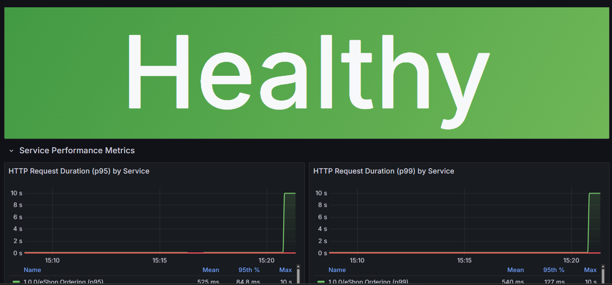
  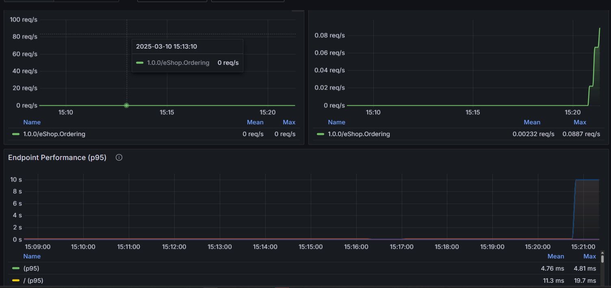
  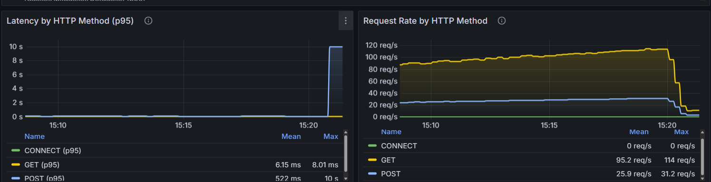
  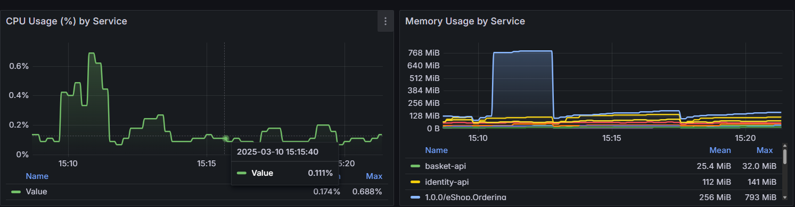
  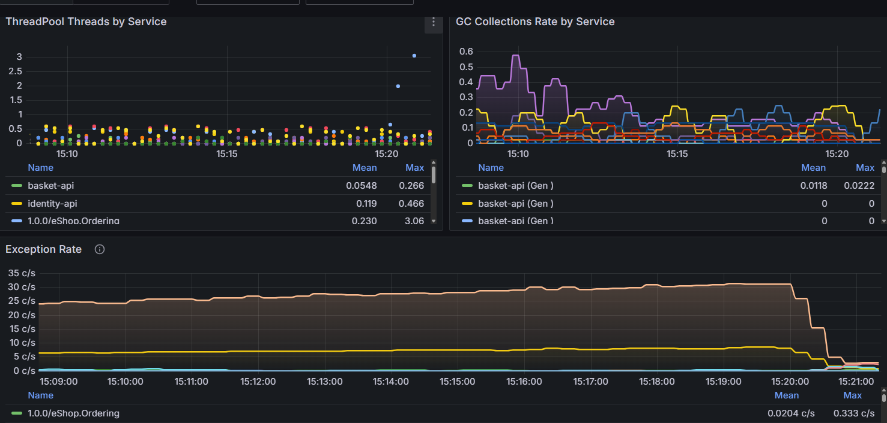
  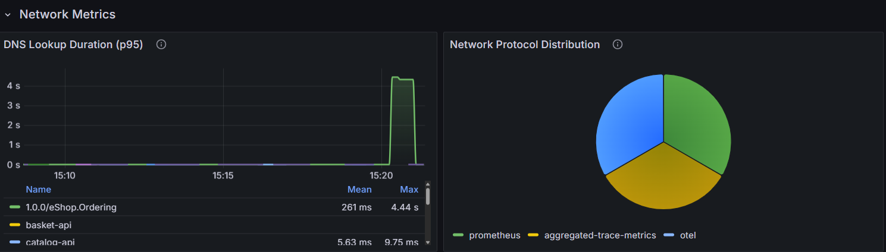
  

Detailed technical metrics for service health:

- **Service Health Status**:
    - Overall health indicator ("Healthy")
    - HTTP Request Duration by Service
    - CPU and Memory Usage by Service

- **Performance Metrics**:
    - ThreadPool Threads by Service
    - GC Collections Rate by Service
    - Exception Rate tracking
    - Network Metrics including DNS lookup duration
    - Status Code Distribution (78% 200 OK responses)

This dashboard helps operations teams monitor the technical health of the services.

### 5. Database Performance Dashboard

  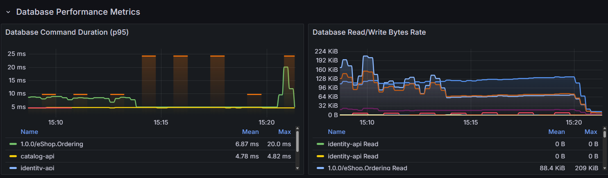
  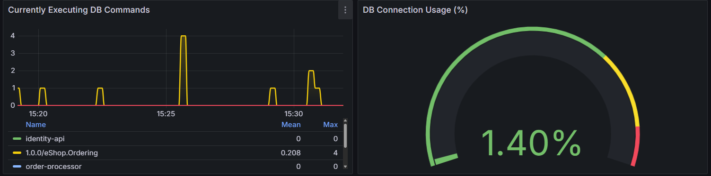
  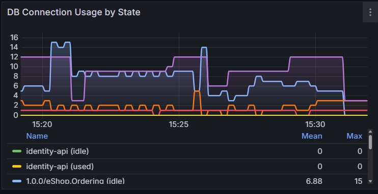

Metrics related to database interactions:

- **Database Command Performance**:
    - Command Duration (p95): Tracking query performance
    - Read/Write Bytes Rate: Monitoring database I/O
    - Currently Executing DB Commands
    - Connection Usage monitoring (1.40%)
    - Connection Usage by State

This dashboard helps database administrators and developers optimize database interactions.

## Data Masking Implementation

The screenshots show effective PII masking in action across the system:

### 1. Payment Processing Trace

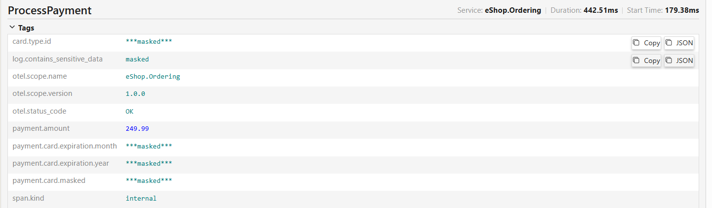

In the `ProcessPayment` span [ProcessPayment](img/ProcessPaymentMasked.png), sensitive payment data is successfully masked:

- `card.type.id`: `***masked***`
- `payment.card.expiration.month`: `***masked***`
- `payment.card.expiration.year`: `***masked***`
- `payment.card.masked`: `***masked***`

The `log.contains_sensitive_data` tag is properly set to `masked` to indicate that sensitive data has been detected and protected.

### 2. Order Processing Trace

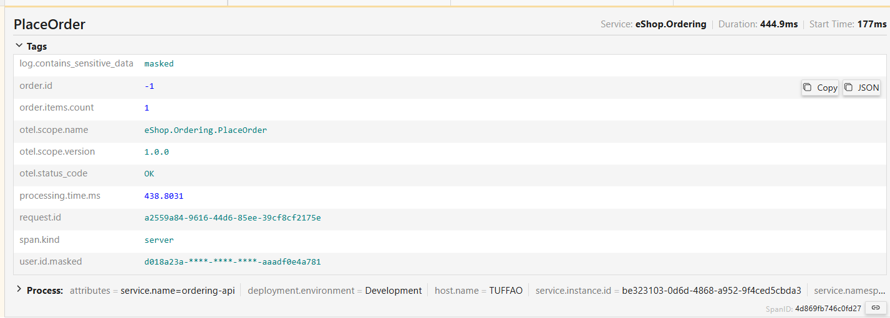

In the `PlaceOrder` span [PlaceOrder](img/PlaceOrderMasked.png), user identity information is masked:

- `user.id.masked`: `d018a23a-****-****-****-aaad0e4a781`
- `log.contains_sensitive_data`: `masked`

This demonstrates the system's ability to identify and mask user identifiers, which could be used for identity theft if exposed.

### 3. API Requests

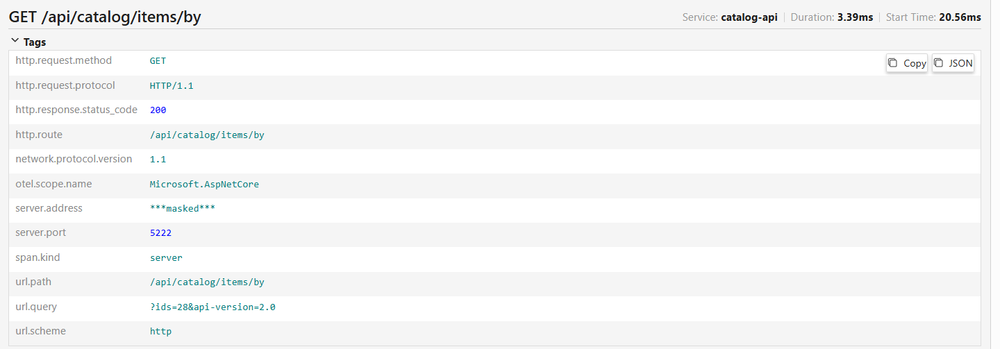

In the Catalog API request trace [ServerAddressMasked](img/ServerAddressMasked.png), server details are protected:

- `server.address`: `***masked***`

This prevents exposing internal infrastructure details that could be useful to attackers.

## Jaeger Monitoring Integration

The implementation successfully integrates Jaeger for distributed tracing:

### 1. Service Discovery

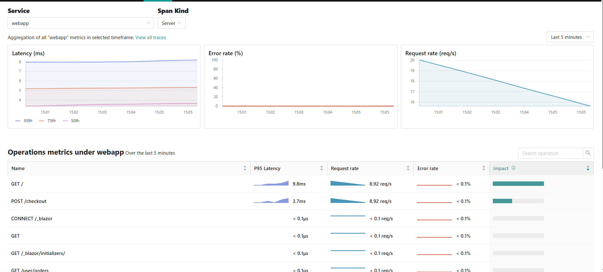

Jaeger properly discovers and monitors all eShop services [Jaeger Monitoring WebAPP](img/Jaeger_Monitoring_WebAPP.png):

- webapp
- basket-api
- catalog-api
- eShop.Ordering (formerly ordering-api)
- identity-api
- order-processor
- payment-processor
- jaeger (self-monitoring)

### 2. Trace Details

Jaeger captures detailed traces showing the full order flow:

- `PlaceOrder` span from eShop.Ordering service [PlaceOrder](img/PlaceOrderMasked.png)
- `ProcessPayment` span showing payment processing [ProcessPayment](img/ProcessPaymentMasked.png)
- `GET /api/catalog/items/by` span from catalog-api service [ServerAddressMasked](img/ServerAddressMasked.png)

### 3. Service Filtering

The Jaeger UI effectively allows filtering by service, as shown in the service selection dropdowns (Image 2).

### 4. Latency Visualization

Jaeger provides detailed timing information for each span (Example: PlaceOrder - 444.9ms, ProcessPayment - 442.51ms), enabling performance analysis.

### 5. Tag-Based Filtering

The Jaeger UI shows tags that can be used for filtering:
- `log.contains_sensitive_data`: `masked`
- `order.id`
- `order.items.count`
- `span.kind`

## Cross-Service Trace Correlation

The implementation successfully correlates traces across services:

1. **Webapp to API Services**: Tracing shows operations from webapp connecting to catalog-api

2. **API to Processing Flow**: The traces show the complete order processing flow from API calls through to the payment processor

3. **Event-Based Communication**: The system captures traces for event-based communication, like the `OrderStatusChangedToStockConfirmedIntegrationEvent receive`

## Metrics Integration

The architecture successfully correlates metrics with traces:

1. **HTTP Request Metrics**: Tracking of request rates, durations, and error rates by service

2. **Business Metrics**: Order counts, values, and failure rates 

3. **Resource Metrics**: CPU, memory, thread pool, and GC metrics 

4. **Database Metrics**: Query performance, connection usage 

## Security Considerations

The implementation demonstrates good security practices:

1. **Comprehensive PII Masking**: All personal and payment information is properly masked

2. **Infrastructure Protection**: Server addresses and internal details are masked

3. **Service Health Isolation**: Each service's health metrics are tracked separately

## Conclusion

The implemented monitoring solution provides comprehensive visibility into the eShop application while maintaining proper security controls. The Grafana dashboards offer both business and technical insights, Jaeger provides detailed distributed tracing, and sensitive data is properly masked throughout the system.

The monitoring setup successfully meets all requirements from the assignment:
- OpenTelemetry is implemented for end-to-end tracing
- Sensitive data is properly masked in telemetry and logs
- Grafana dashboards effectively visualize traces and metrics
- The optional data security measures have been implemented