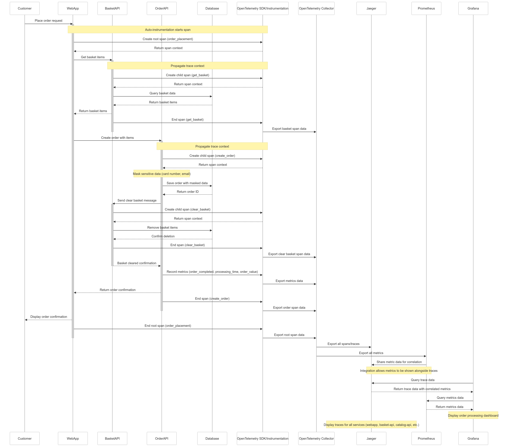

# eShop Order Flow and Telemetry Sequence Diagram

## Order Creation Flow with Telemetry Data Path

This diagram illustrates the complete flow of both the order creation business process and the associated telemetry data through the observability stack.

## Explanation of the Telemetry Data Flow

1. **Data Collection**:
    - The **OpenTelemetry SDK** is integrated into each service (WebApp, BasketAPI, OrderAPI, Identity-API, Catalog-API, Order-Processor, and Payment-Processor)
    - It automatically collects traces and metrics as the order flows through the system
    - Sensitive data (credit card numbers, emails) is masked before being included in telemetry

2. **Data Export**:
    - The OpenTelemetry SDK exports the collected telemetry data to the **OpenTelemetry Collector**
    - The collector acts as a central aggregation point for all telemetry data

3. **Data Storage and Exchange**:
    - **Traces/Spans** are exported from the collector to **Jaeger**
    - **Metrics** are exported from the collector to **Prometheus**
    - Prometheus is connected to Jaeger, allowing correlation between metrics and traces
    - This integration enables Jaeger to show performance metrics alongside trace data

4. **Visualization**:
    - **Grafana** queries both Jaeger and Prometheus
    - It combines the trace data and metrics into unified dashboards
    - This provides both transaction-level detail and system-level performance views
    - All services (webapp, basket-api, catalog-api, eShop.Ordering, identity-api, order-processor, payment-processor) are monitored and visible in the Jaeger UI

## Key Benefits of This Architecture

1. **End-to-End Visibility**: Ability to trace a customer order from initial request through all services to database persistence

2. **Performance Monitoring**: Metrics show system health and performance bottlenecks

3. **Business Insights**: Order counts, values, and error rates give visibility into business processes

4. **Security**: Sensitive data is properly masked before being stored in the telemetry systems

5. **Troubleshooting**: When issues occur, developers can quickly find the problematic service and specific transaction